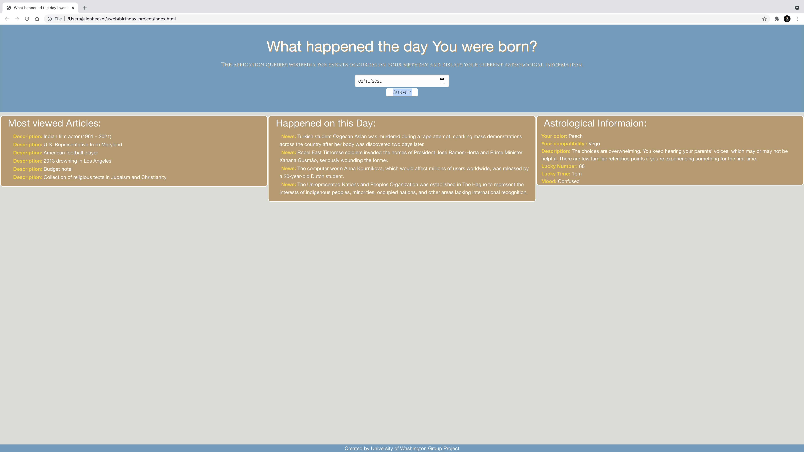

# birthday-project:
     In this app we are taking the users DOB and putting it into two separate APIs to show the users astrological information and important events on that day in history.

 ## Motivation:
     Birthday's are special days, and people want to know what was going on when it was their day. When a user inserts the date of their latest brithday we provide them with important world events on their day of birth, their power color, the signs they are most compatible with, a description of their personality, their lucky number, their lucky time, and their general mood.

 ## Build: v 1.0

 ## Code: 
     Utilized HTML/CSS (foundation), jQuery, JavaScript

 ## APIs: 
     https://sameer-kumar-aztro-v1.p.rapidapi.com/?sign=
     https://en.wikipedia.org/api/rest_v1/feed/featured/

## Mock-Up

 ## Utilization:
     Open provided link and enter the requested information into the designated boxes. Pressing the submit button feeds that data to two APIs that return important world events and astrological information.

 ## Credits:
     Credit goes to Taylor Anderson, Ben Koala, and Elham Bazazzadeh. Jalen Heckel acted as project manager for the project.
 ## Links:
     GitHub Repo: https://github.com/jheckel-dev/birthday-project
     Deployed URL: 